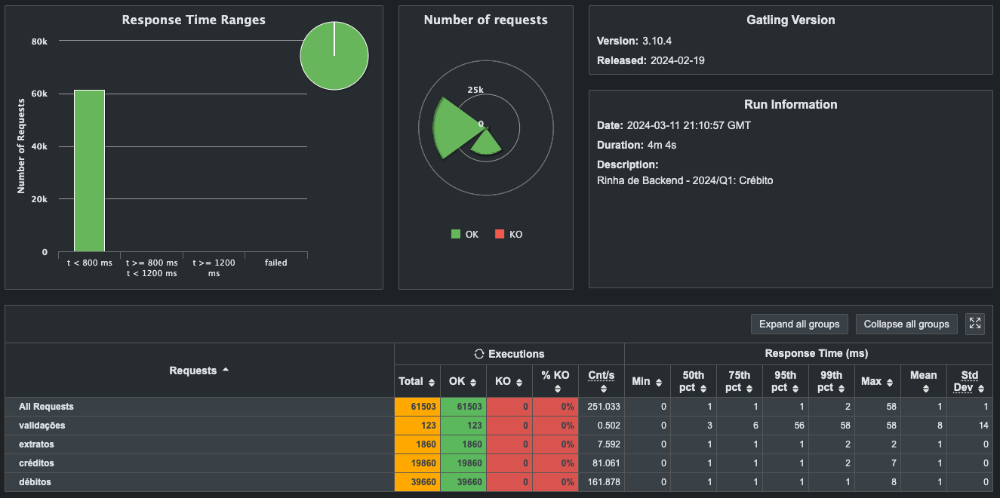
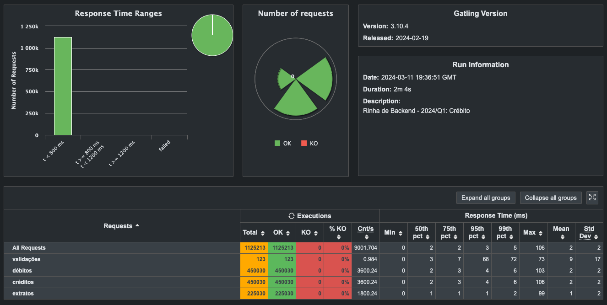

Rinha de Backend 2023/Q1

Para contexto: https://github.com/zanfranceschi/rinha-de-backend-2024-q1

Tentando ir na contramão dos stacks usuais (PostgreSQL etc.), fiz uma versão
com **Go** com **fasthttp** no webserver e **BoltDB** conectado via **gRPC** como banco de dados.

Os testes foram feitos com **nginx** e rodando as instâncias de _httpserver_ (2x) e _boltdb_ localmente na máquina, sem Docker,
pois já havia passado o prazo de submissão, então não me importei que rodasse fora da minha máquina.

O resultado foi bem satisfatório:

Mexendo nos parâmetros do Gatling e colocando para 10k req/s, obtive o gráfico abaixo:

Agora é aguardar a terceira edição! :D
